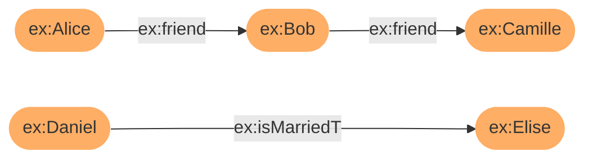

# Getting Started with Corese-Core

This tutorial shows how to use the Corese-Core library through simple examples of its main features.
We assume basic knowledge of Java programming and the Semantic Web.

- The first section describes how to create, load, and export a Graph.
- The second section shows how to query a graph using [SPARQL](https://www.w3.org/TR/sparql11-query/).
- The third section details how to validate a graph using the [Shapes Constraint Language (SHACL)](https://www.w3.org/TR/shacl/).
- The fourth section shows how to transform a graph using the extension language [SPARQL Template Transformation Language (STTL)](https://files.inria.fr/corese/doc/sttl.html).
- The fifth section details how to apply a set of rules on a graph using the [SPARQL Rule](https://files.inria.fr/corese/doc/rule.html) extension language.
- Finally, the sixth section describes how to define and use functions with the [LDScript](https://files.inria.fr/corese/doc/ldscript.html) extension language.

## **1. Installation**

Installation instructions are available on the [installation page](../install.md).

## **2. Graph**

This section describes how to create a graph manually, load a graph from a file, and serialize a graph to a file.

### **2.1. Build a Graph Programmatically**

The example below shows how to create the following RDF graph:


This graph represents three RDF statements:

- Edith Piaf is a singer.
- Edith Piaf's first name is Edith.
- Edith Piaf's last name is Piaf.

```java
import fr.inria.corese.core.kgram.api.core.Node;
import fr.inria.corese.core.logic.RDF;

public class Example {
    public static void main(String[] args) {
        // Define the namespace 'ex'
        String ex = "http://example.org/";

        // Create a new empty Graph
        Graph graph = Graph.create();

        // Create and add IRIs to the Graph
        Node edithPiafIRI = graph.addResource(ex + "EdithPiaf");
        Node singerIRI = graph.addResource(ex + "Singer");

        // Create and add properties to the Graph
        Node rdfTypeProperty = graph.addProperty(RDF.TYPE);
        Node firstNameProperty = graph.addProperty(ex + "firstName");
        Node lastNameProperty = graph.addProperty(ex + "lastName");

        // Create and add literals to the Graph
        Node edithLiteral = graph.addLiteral("Edith");
        Node piafLiteral = graph.addLiteral("Piaf");

        // Add statements to the graph
        graph.addEdge(edithPiafIRI, rdfTypeProperty, singerIRI);
        graph.addEdge(edithPiafIRI, firstNameProperty, edithLiteral);
        graph.addEdge(edithPiafIRI, lastNameProperty, piafLiteral);
    }
}
```

### **2.2. Load a Graph from a File**

This example shows how to load a graph from a file.

```java
import fr.inria.corese.core.api.Loader;
import fr.inria.corese.core.load.Load;
import fr.inria.corese.core.load.LoadException;

public class Example {
    public static void main(String[] args) throws LoadException {

        // Create a new empty Graph
        Graph graph = Graph.create();

        // Create loader and parse file
        Load loader = Load.create(graph);
        loader.parse("input_graph_file.ttl", Loader.format.TURTLE_FORMAT);
    }
}
```

Corese Loader supports the following formats:

- RDF/XML (`Loader.format.RDFXML_FORMAT`)
- Turtle (`Loader.format.TURTLE_FORMAT`)
- TriG (`Loader.format.TRIG_FORMAT`)
- JSON-LD (`Loader.format.JSONLD_FORMAT`)
- N-Triples (`Loader.format.NT_FORMAT`)
- N-Quads (`Loader.format.NQUADS_FORMAT`)
- RDFa (`Loader.format.RDFA_FORMAT`)

### **2.3. Export a Graph to a File**

This example shows how to serialize a graph into a file in Turtle format.

```java
import java.io.FileWriter;
import java.io.IOException;

import fr.inria.corese.core.kgram.api.core.Node;
import fr.inria.corese.core.print.ResultFormat;
import fr.inria.corese.core.sparql.api.ResultFormatDef;

public class Example {
    public static void main(String[] args) throws IOException {

        // Create a new empty Graph
        Graph graph = Graph.create();

        // Add some triples to the graph
        String ex = "http://example.org/";
        Node edithPiafIRI = graph.addResource(ex + "EdithPiaf");
        Node firstNameProperty = graph.addProperty(ex + "firstName");
        Node edithLiteral = graph.addLiteral("Edith");
        graph.addEdge(edithPiafIRI, firstNameProperty, edithLiteral);

        // Create exporter
        ResultFormat exporter = ResultFormat.create(graph, ResultFormatDef.format.TURTLE_FORMAT);
        String result = exporter.toString();

        // Write result to a file
        try (FileWriter writer = new FileWriter("output_graph.ttl")) {
            writer.write(result);
        }
    }
}
```

Corese can serialize graphs into the following formats:

- RDF/XML (`ResultFormatDef.format.RDF_XML_FORMAT`)
- Turtle (`ResultFormatDef.format.TURTLE_FORMAT`)
- TriG (`ResultFormatDef.format.TRIG_FORMAT`)
- JSON-LD (`ResultFormatDef.format.JSONLD_FORMAT`)
- N-Triples (`ResultFormatDef.format.NTRIPLES_FORMAT`)
- N-Quads (`ResultFormatDef.format.NQUADS_FORMAT`)
- Canonical RDF SHA-256 (`ResultFormatDef.format.RDFC10_FORMAT`)
- Canonical RDF SHA-384 (`ResultFormatDef.format.RDFC10_SHA384_FORMAT`)

## **3. SPARQL Queries**

This section describes how to query a graph using [SPARQL](https://www.w3.org/TR/sparql11-query/) in Corese.

### **3.1. Executing a SPARQL SELECT Query**

This example shows how to execute a SPARQL `SELECT` query and retrieve results.

```java
import fr.inria.corese.core.kgram.api.core.Node;
import fr.inria.corese.core.kgram.core.Mappings;
import fr.inria.corese.core.print.ResultFormat;
import fr.inria.corese.core.query.QueryProcess;
import fr.inria.corese.core.sparql.exceptions.EngineException;

public class Example {
    public static void main(String[] args) throws EngineException {

        // Create a new empty Graph
        Graph graph = Graph.create();

        // Add some triples to the graph
        String ex = "http://example.org/";
        Node edithPiafIRI = graph.addResource(ex + "EdithPiaf");
        Node firstNameProperty = graph.addProperty(ex + "firstName");
        Node edithLiteral = graph.addLiteral("Edith");
        graph.addEdge(edithPiafIRI, firstNameProperty, edithLiteral);

        // Load and execute SPARQL query
        QueryProcess exec = QueryProcess.create(graph);
        Mappings map = exec.query("select * where { ?s ?p ?o }");

        // Print results in Markdown format
        System.out.println(ResultFormat.create(map, ResultFormat.format.CSV_FORMAT).toString());
    }
}
```

Other supported formats:

```java
ResultFormat.format.XML_FORMAT
ResultFormat.format.JSON_FORMAT
ResultFormat.format.CSV_FORMAT
ResultFormat.format.TSV_FORMAT
ResultFormat.format.MARKDOWN_FORMAT
```

### 3.2. SPARQL ASK Query

This example shows how to execute a SPARQL `ASK` query and print results.

```java
import fr.inria.corese.core.kgram.api.core.Node;
import fr.inria.corese.core.kgram.core.Mappings;
import fr.inria.corese.core.query.QueryProcess;
import fr.inria.corese.core.sparql.exceptions.EngineException;

public class Example {
    public static void main(String[] args) throws EngineException {

        // Create a new empty Graph
        Graph graph = Graph.create();

        // Add some triples to the graph
        String ex = "http://example.org/";
        Node edithPiafIRI = graph.addResource(ex + "EdithPiaf");
        Node firstNameProperty = graph.addProperty(ex + "firstName");
        Node edithLiteral = graph.addLiteral("Edith");
        graph.addEdge(edithPiafIRI, firstNameProperty, edithLiteral);

        // Load and execute SPARQL query
        QueryProcess exec = QueryProcess.create(graph);
        Mappings map = exec.query("PREFIX ex: <http://example.org/> SELECT ?x WHERE { ex:EdithPiaf ex:firstName ?x }");

        // Print boolean result
        // If the mapping is empty, the result is false; otherwise, it is true.
        System.out.println(!map.isEmpty());
    }
}
```

### **3.3. SPARQL CONSTRUCT Query**

This example shows how to execute a SPARQL `CONSTRUCT` query and retrieve results.

```java
import fr.inria.corese.core.api.Loader;
import fr.inria.corese.core.kgram.core.Mappings;
import fr.inria.corese.core.load.Load;
import fr.inria.corese.core.print.ResultFormat;
import fr.inria.corese.core.query.QueryProcess;
import fr.inria.corese.core.sparql.exceptions.EngineException;

public class Example {
    public static void main(String[] args) throws EngineException {

        // Create a new empty Graph
        Graph graph = Graph.create();

        // Add some triples to the graph
        Load loader = Load.create(graph);
        loader.parse("input_graph_file.ttl", Loader.format.TURTLE_FORMAT);

        // Load and execute SPARQL query
        QueryProcess exec = QueryProcess.create(graph);
        Mappings map = exec.query("""
                prefix foaf: <http://xmlns.com/foaf/0.1/>
                prefix vcard: <http://www.w3.org/2001/vcard-rdf/3.0#>

                construct {
                    ?person vcard:FN ?name
                }
                where {
                    ?person foaf:name ?name.
                }
                """);

        // Get result graph
        Graph resultGraph = (Graph) map.getGraph();

        // Print results in TriG format
        System.out.println(ResultFormat.create(resultGraph, ResultFormat.format.TRIG_FORMAT).toString());
    }
}
```

Other supported formats:

```java
ResultFormat.format.RDF_XML_FORMAT
ResultFormat.format.TURTLE_FORMAT
ResultFormat.format.TRIG_FORMAT
ResultFormat.format.JSONLD_FORMAT
ResultFormat.format.NTRIPLES_FORMAT
ResultFormat.format.NQUADS_FORMAT
ResultFormat.format.RDFC10_FORMAT
ResultFormat.format.RDFC10_SHA384_FORMAT
```

### **3.4. SPARQL UPDATE Query**

This example shows how to execute a SPARQL `UPDATE` query.

```java
import fr.inria.corese.core.api.Loader;
import fr.inria.corese.core.kgram.core.Mappings;
import fr.inria.corese.core.load.Load;
import fr.inria.corese.core.print.ResultFormat;
import fr.inria.corese.core.query.QueryProcess;
import fr.inria.corese.core.sparql.exceptions.EngineException;

public class Example {
    public static void main(String[] args) throws EngineException {

        // Create a new empty Graph
        Graph graph = Graph.create();

        // Add some triples to the graph
        Load loader = Load.create(graph);
        loader.parse("input_graph_file.ttl", Loader.format.TURTLE_FORMAT);

        // Load and execute SPARQL query
        QueryProcess exec = QueryProcess.create(graph);
        exec.query("""
                    PREFIX foaf: <http://xmlns.com/foaf/0.1/>
                    PREFIX vcard: <http://www.w3.org/2001/vcard-rdf/3.0#>

                    INSERT {
                        ?person vcard:FN ?name
                    }
                    WHERE {
                        ?person foaf:name ?name.
                    }
                """);

        // Print updated graph in Turtle format
        System.out.println(ResultFormat.create(graph, ResultFormat.format.TURTLE_FORMAT).toString());
    }
}
```

Other supported formats:

```java
ResultFormat.format.RDF_XML_FORMAT
ResultFormat.format.TURTLE_FORMAT
ResultFormat.format.TRIG_FORMAT
ResultFormat.format.JSONLD_FORMAT
ResultFormat.format.NTRIPLES_FORMAT
ResultFormat.format.NQUADS_FORMAT
ResultFormat.format.RDFC10_FORMAT
ResultFormat.format.RDFC10_SHA384_FORMAT
```

## **4. Shapes Constraint Language (SHACL)**

This section shows how to validate a graph using [SHACL](https://www.w3.org/TR/shacl/).

```java
import fr.inria.corese.core.load.Load;
import fr.inria.corese.core.load.LoadException;
import fr.inria.corese.core.print.ResultFormat;
import fr.inria.corese.core.shacl.Shacl;
import fr.inria.corese.core.sparql.api.ResultFormatDef;
import fr.inria.corese.core.sparql.exceptions.EngineException;

public class Example {
    public static void main(String[] args) throws LoadException, EngineException {
        // Load data graph
        Graph dataGraph = Graph.create();
        Load loader = Load.create(dataGraph);
        loader.parse("data.ttl");

        // Load shape graph
        Graph shapeGraph = Graph.create();
        loader = Load.create(shapeGraph);
        loader.parse("shapes.ttl");

        // Validate the data
        Shacl shacl = new Shacl(dataGraph, shapeGraph);
        Graph result = shacl.eval();

        // Print results
        ResultFormat exporter = ResultFormat.create(result, ResultFormatDef.format.TURTLE_FORMAT);
        System.out.println(exporter.toString());
    }
}
```

**Input graph file path:**

```turtle
@prefix ex: <http://example.org/ns#> .
@prefix rdf: <http://www.w3.org/1999/02/22-rdf-syntax-ns#> .

ex:Alice ex:ssn "987-65-4323" ;
    ex:worksFor ex:Haribo, ex:KitKat ;
    rdf:type ex:Person .

ex:Bob ex:ssn "124-35-6789" ;
    ex:worksFor ex:Twitch ;
    rdf:type ex:Person .

ex:Calvin ex:ssn "648-67-6545" ;
    ex:worksFor ex:UntypedCompany ;
    rdf:type ex:Person .

ex:Haribo rdf:type ex:Company .
ex:KitKat rdf:type ex:Company .
ex:Twitch rdf:type ex:Company .
ex:UntypedCompany rdf:type ex:Company .
```

**Input shape file path:**

```turtle
@prefix sh: <http://www.w3.org/ns/shacl#> .
@prefix xsd: <http://www.w3.org/2001/XMLSchema#> .
@prefix ex: <http://example.org/ns#> .
@prefix rdf: <http://www.w3.org/1999/02/22-rdf-syntax-ns#> .

ex:PersonShape
    a sh:NodeShape ;
    sh:targetClass ex:Person ;
    sh:property [
        sh:path ex:ssn ;
        sh:maxCount 1 ;
        sh:datatype xsd:string ;
        sh:pattern "^\\d{3}-\\d{2}-\\d{4}$" ;
    ] ;
    sh:property [
        sh:path ex:worksFor ;
        sh:class ex:Company ;
        sh:nodeKind sh:IRI ;
    ] ;
    sh:closed true ;
    sh:ignoredProperties ( rdf:type ) .
```

**Result:**

```turtle
@prefix xsh: <http://www.w3.org/ns/shacl#> .
@prefix sh: <http://www.w3.org/ns/shacl#> .

[a sh:ValidationReport ;
    sh:conforms true] .
```

## 5. SPARQL Template Transformation Language (STTL)

This section shows how to transform a graph using a subset of the [SPARQL Template Transformation Language (STTL)](https://files.inria.fr/corese/doc/sttl.html).

### 5.1. Transform a graph into a visual HTML format

This example details how to load a data graph from a file, transform it into a visual HTML format, and export the result to a file.

```java
import java.io.IOException;
import java.nio.charset.StandardCharsets;
import java.nio.file.Files;
import java.nio.file.Path;

import fr.inria.corese.core.kgram.core.Mappings;
import fr.inria.corese.core.load.Load;
import fr.inria.corese.core.load.LoadException;
import fr.inria.corese.core.print.ResultFormat;
import fr.inria.corese.core.query.QueryProcess;
import fr.inria.corese.core.sparql.exceptions.EngineException;

public class Example {
    public static void main(String[] args) throws LoadException, EngineException, IOException {
        // Open template file
        Path path = Path.of("input template file path");
        String sttl_query = Files.readString(path, StandardCharsets.UTF_8);

        // Load data graph
        Graph dataGraph = Graph.create();
        Load ld = Load.create(dataGraph);
        ld.parse("input graph file path");

        // Apply STTL query
        QueryProcess exec = QueryProcess.create(dataGraph);
        Mappings map = exec.query(sttl_query);

        // Export result
        ResultFormat result_xml = ResultFormat.create(map);
        result_xml.write("output file path");
    }
}
```

**Input template file:**

```rq
template {
    format {
        "<html>\n\n<body>\n\t<table>\n%s\t</table>\n</body>\n\n</html>"
        group {
            format {
                "\t\t<tr>\n\t\t\t<td>%s</td>\n\t\t\t<td>%s</td>\n\t\t\t<td>%s</td>\n\t\t</tr>\n"
                ?s ?p ?o
            }
        }
    }
}
where {
    ?s ?p ?o
}
order by ?s ?p ?o
```

**Result:**

```html
<html>
<body>
    <table>
        <tr>
            <td>http://example.org/EdithPiaf</td>
            <td>http://example.org/firstName</td>
            <td>Edith</td>
        </tr>
        <tr>
            <td>http://example.org/EdithPiaf</td>
            <td>http://example.org/lastName</td>
            <td>Piaf</td>
        </tr>
        <tr>
            <td>http://example.org/EdithPiaf</td>
            <td>http://www.w3.org/1999/02/22-rdf-syntax-ns#type</td>
            <td>http://example.org/Singer</td>
        </tr>
    </table>
</body>
</html>
```

| ?s                             | ?p                                                | ?o                          |
| ------------------------------ | ------------------------------------------------- | --------------------------- |
| <http://example.org/EdithPiaf> | <http://example.org/firstName>                    | Edith                       |
| <http://example.org/EdithPiaf> | <http://example.org/lastName>                     | Piaf                        |
| <http://example.org/EdithPiaf> | <http://www.w3.org/1999/02/22-rdf-syntax-ns#type> | <http://example.org/Singer> |

## 6. **SPARQL Rule**

This section details how to apply a set of rules on a graph using the [SPARQL Rule extension language](https://files.inria.fr/corese/doc/rule.html).

### 6.1. Load rules from a file

The example below shows the application of two rules (symmetry and transitivity) on a simple graph.

```java
import fr.inria.corese.core.load.Load;
import fr.inria.corese.core.load.LoadException;
import fr.inria.corese.core.load.RuleLoad;
import fr.inria.corese.core.rule.RuleEngine;
import fr.inria.corese.core.sparql.exceptions.EngineException;

public class Example {
    public static void main(String[] args) throws LoadException, EngineException {
        // Create and load data in a graph
        Graph dataGraph = Graph.create();
        Load dataLoader = Load.create(dataGraph);
        dataLoader.parse("input graph file path");

        // Create and load rules into a rules engine
        RuleEngine ruleEngine = RuleEngine.create(dataGraph);
        RuleLoad ruleLoader = RuleLoad.create(ruleEngine);
        ruleLoader.parse("input rules file path.rul");

        // Apply rules on the graph
        ruleEngine.process();
    }
}
```

**Original graph:**



**Rules file:**

- Symmetry: `if X➝Y then Y➝X`
- Transitivity: `if X➝Y➝Z then X➝Z`

```xml
<?xml version="1.0"?>

<rdf:RDF
    xmlns:rdf="http://www.w3.org/1999/02/22-rdf-syntax-ns#"
    xmlns="http://ns.inria.fr/corese/rule/">

    <rule>
        <body>
            <![CDATA[
                prefix owl: <http://www.w3.org/2002/07/owl#>
                construct {
                    ?x ?p ?z
                }
                where {
                    ?p a owl:TransitiveProperty .
                    ?x ?p ?y .
                    ?y ?p ?z
                }
            ]]>
        </body>
    </rule>

    <rule>
        <body>
            <![CDATA[
                prefix owl: <http://www.w3.org/2002/07/owl#>
                construct {
                   ?y ?p ?x
                }
                where {
                    ?p a owl:SymmetricProperty .
                    ?x ?p ?y .
                }
            ]]>
        </body>
    </rule>
</rdf:RDF>
```

**Result graph:**


### 6.2. OWL Rules

The example below shows the application of OWL RL rules.

```java
import fr.inria.corese.core.api.Loader;
import fr.inria.corese.core.load.Load;
import fr.inria.corese.core.load.LoadException;
import fr.inria.corese.core.rule.RuleEngine;
import fr.inria.corese.core.sparql.exceptions.EngineException;

public class Example {
    public static void main(String[] args) throws LoadException, EngineException {
        // Create a new empty Graph
        Graph graph = Graph.create();

        // Add some triples to the graph
        Load loader = Load.create(graph);
        loader.parse("input_graph_file.ttl", Loader.format.TURTLE_FORMAT);

        // Apply rules
        RuleEngine engine = RuleEngine.create(graph);
        engine.setProfile(RuleEngine.OWL_RL);
        engine.process();
    }
}
```

## 7. LDScript

This section describes how to define and use functions with the [LDScript extension language](https://files.inria.fr/corese/doc/ldscript.html).

### 7.1. Fibonacci function call from Java

This example shows how to define and compute the twelfth number of the Fibonacci sequence.

```java
import java.io.IOException;
import java.nio.charset.StandardCharsets;
import java.nio.file.Files;
import java.nio.file.Path;

import fr.inria.corese.core.query.QueryProcess;
import fr.inria.corese.core.sparql.api.IDatatype;
import fr.inria.corese.core.sparql.datatype.DatatypeMap;
import fr.inria.corese.core.sparql.exceptions.EngineException;

public class Example {
    public static void main(String[] args) throws EngineException, IOException {
        // Open LDScript file
        Path path = Path.of("input LDScript file path.rq");
        String ldScript = Files.readString(path, StandardCharsets.UTF_8);

        // Compile LDScript
        QueryProcess exec = QueryProcess.create();
        exec.compile(ldScript);

        // Compute the twelfth number of the Fibonacci sequence
        String name = "http://ns.inria.fr/fibonacci";
        IDatatype dt = exec.funcall(name, DatatypeMap.newInstance(12));

        // Print result
        System.out.println(dt);
    }
}
```

**Input LDScript file path:**

```rq
prefix fun: <http://ns.inria.fr/>

@public function fun:fibonacci(n) {
    if (n < 0) {
        error()
    }
    else if (n = 0) {
        return(0)
    }
    else if (n = 1) {
        return(1)
    }
    else {
        return (fun:fibonacci(n - 1) + fun:fibonacci(n - 2))
    }
}
```

### 7.2. LDScript in SPARQL

This example shows how to call an LDScript function from a SPARQL query.

```java
import java.io.IOException;

import fr.inria.corese.core.kgram.core.Mappings;
import fr.inria.corese.core.load.Load;
import fr.inria.corese.core.query.QueryProcess;
import fr.inria.corese.core.sparql.exceptions.EngineException;

public class Example {
    public static void main(String[] args) throws EngineException, IOException {
        String check_query = """
                prefix ex: <http://example.com/city/>
                prefix rdf: <http://www.w3.org/1999/02/22-rdf-syntax-ns#>
                prefix fun: <http://ns.inria.fr/>

                select ?name ?area
                where {
                    ?city rdf:type ex:city ;
                          ex:name ?name ;
                          ex:area ?area .
                    filter(?area > fun:toSquareKm(40))
                }

                # Convert square mile to square kilometer
                function fun:toSquareKm(squareMile) {
                    return (squareMile * 2.59)
                }
                """;

        // Load graph
        Graph graph = Graph.create();
        Load ld = Load.create(graph);
        ld.parse("input file path");

        // SPARQL query
        QueryProcess exec = QueryProcess.create(graph);
        Mappings map = exec.query(check_query);
    }
}
```

### 7.3. Advanced Example

The following Java program computes the percentage of people subscribed to social networks in a city compared to its total number of inhabitants. The data is collected from Wikidata.

```java
import java.io.IOException;
import java.nio.charset.StandardCharsets;
import java.nio.file.Files;
import java.nio.file.Path;

import fr.inria.corese.core.query.QueryProcess;
import fr.inria.corese.core.sparql.api.IDatatype;
import fr.inria.corese.core.sparql.exceptions.EngineException;

public class Example {
    public static void main(String[] args) throws EngineException, IOException {
        // Open LDScript file
        Path path = Path.of("input LDScript file path.rq");
        String ldScript = Files.readString(path, StandardCharsets.UTF_8);

        // Compile LDScript
        QueryProcess exec = QueryProcess.create();
        exec.compile(ldScript);

        // Execute program
        String name = "http://ns.inria.fr/main";
        IDatatype dt = exec.funcall(name);

        // Print result
        System.out.println(dt);
    }
}
```

**Input LDScript File:**

```rq
prefix fun: <http://ns.inria.fr/>

prefix wd: <http://www.wikidata.org/entity/>
prefix wdt: <http://www.wikidata.org/prop/direct/>
prefix wikibase: <http://wikiba.se/ontology#>
prefix bd: <http://www.bigdata.com/rdf#>
prefix rdfs: <http://www.w3.org/2000/01/rdf-schema#>

@public
function fun:percentage(sub, total) {
    return (sub / total * 100)
}

@public
function fun:citypopulationsocialmedia() {
    query(
        select ?city ?citylabel ?population ?socialmediafollower where {
            service <https://query.wikidata.org/sparql> {
                ?city wdt:P31 wd:Q1549591;
                wdt:P8687 ?socialmediafollower;
                wdt:P1082 ?population.
                optional {
                    ?city rdfs:label ?citylabel
                    filter (lang(?citylabel) = "en").
                }
            }
        }
        order by desc (?socialmediafollower)
        limit 100
    )
}

@public
function fun:main() {
    xt:sort(
        maplist (
            function(x) {
                let ((citylabel population socialmediafollower) = x) {
                    return (xt:list(citylabel, fun:percentage(socialmediafollower, population)))
                }
            },
            fun:citypopulationsocialmedia()
        ),
        function(x,y) {
            let ((x_name, x_value) = x, (y_name, y_value) = y) {
                if (x_value < y_value, 1, if(x=y, o, -1))
            }
        }
    )
}
```
